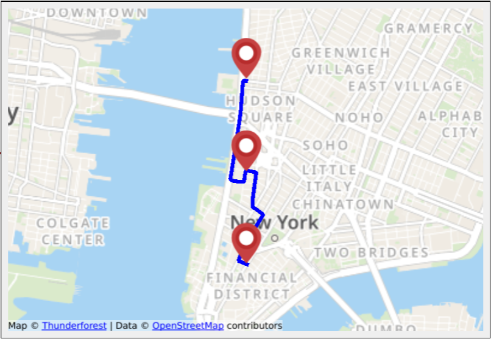

# An example usage of Qt Quick [map](https://doc.qt.io/qt-6/qml-qtlocation-map.html) inside a Qt Widgets program

  

### References

* [sonds1/QmlMap](https://github.com/sonds1/QmlMap)
* [Calling a QML function from C++](https://stackoverflow.com/questions/20000255/calling-a-qml-function-from-c)
* [QT docs](https://doc.qt.io/)
